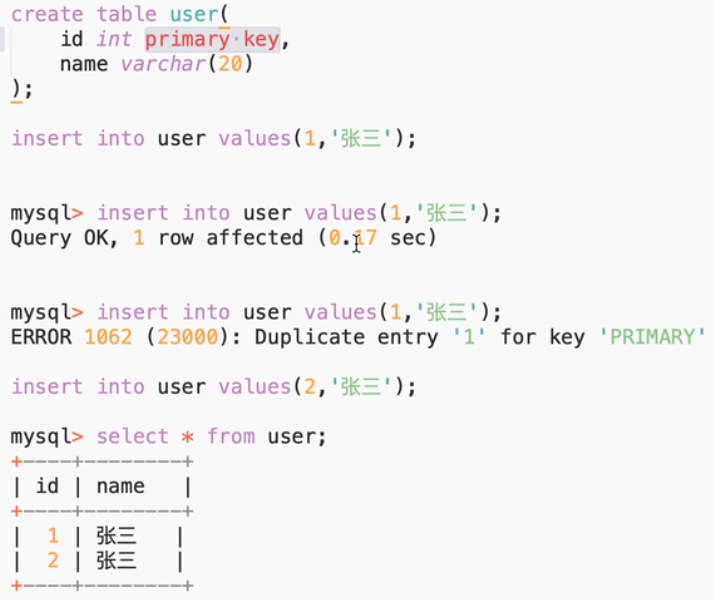
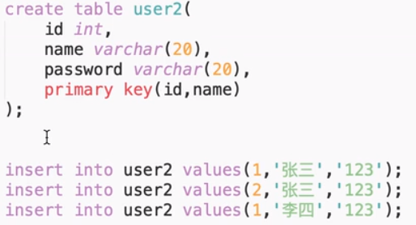

## MySQL(关系型数据库管理系统)

### 一、 如何使用终端操作数据库？

1. #### 如何登陆数据库服务器？
> mysql -uroot -password;

2. #### 如何登陆数据库中所有的数据库？

```
mysql> show databases;

+--------------------+
| Database           |
+--------------------+
| information_schema |
| mysql              |
| performance_schema |
| sys                |
+--------------------+
4 rows in set (0.01 sec)
```

3. #### 如何选中某一个数据库进行操作？

> use  (选中一个数据库)
  select * from  ;(数据库名称) //SQL 语句中的查询
增加相应的条件
  selet * from where Admin_ID=1;

4. #### 如何退出数据库服务器？
> mysql> exit；

5. #### 如何在数据库服务器中创建我们的数据库？
> mysql> create database test;
Query OK, 1 row affected (0.01 sec)

#### 选中数据库
```
mysql> use test;
Database changed
```

#### 如何查看某个数据库中所有的数据表？
```
mysql> show tables;
Empty set (0.00 sec)
```

#### 如何创建一个数据表？

```
mysql> CREATE TABLE pet(数据表的名称) (
    -> name VARCHAR(20),
    -> owner VARCHAR(20),
    -> species VARCHAR(20),
    -> sex CHAR(1),
    -> birth DATE,
    -> death DATE);

创建成功
mysql> CREATE TABLE pet (
    -> name VARCHAR(20),
    -> owner VARCHAR(20),
    -> species VARCHAR(20),
    -> sex CHAR(1),
    -> birth DATE,
    -> death DATE);
Query OK, 0 rows affected (0.03 sec)

查看数据表是否创建成功
mysql> show tables;
+----------------+
| Tables_in_test |
+----------------+
| pet            |
+----------------+
1 row in set (0.00 sec)


查看创建好的数据表的结构
mysql> describe pet;
+---------+-------------+------+-----+---------+-------+
| Field   | Type        | Null | Key | Default | Extra |
+---------+-------------+------+-----+---------+-------+
| name    | varchar(20) | YES  |     | NULL    |       |
| owner   | varchar(20) | YES  |     | NULL    |       |
| species | varchar(20) | YES  |     | NULL    |       |
| sex     | char(1)     | YES  |     | NULL    |       |
| birth   | date        | YES  |     | NULL    |       |
| death   | date        | YES  |     | NULL    |       |
+---------+-------------+------+-----+---------+-------+
6 rows in set (0.00 sec)
```

#### 如何查看数据表中的记录？

```
mysql> select * from pet;
Empty set (0.01 sec)
```

#### 如何往数据表中添加数据记录？

```
mysql> insert into pet
    -> VALUES ('puffball','Diane','hamster','f','1999-03-30',NULL);
Query OK, 1 row affected (0.00 sec)    
```

#### 再一次查询

```
mysql> select * from pet;
+----------+-------+---------+------+------------+-------+
| name     | owner | species | sex  | birth      | death |
+----------+-------+---------+------+------------+-------+
| puffball | Diane | hamster | f    | 1999-03-30 | NULL  |
+----------+-------+---------+------+------------+-------+
1 row in set (0.00 sec)
```

```
1. MySQL 常用数据类型有哪些？

> 数值、 日期/时间、 字符串(字符)

2. 数据类型如何选择？

日期 选择按照格式
数值和字符串按照大小
```

#### 如何删除数据？

> delete from pet where name='fluffy';

#### 如何修改数据？

> update pet set name='名字' where owner='对应的数据'

### MySQL建表约束

1. 
> 主键约束
它能够唯一确定一张表中的一条记录，也就是我们通过给某个字段添加约束，就可以使得该字段不重复不为空

> 添加 id int primary key 约束
主键内的字段不能重复
```png```


> 主键内的字段不能为


> 联合主键
只要联合的主键值加起来不重复就可以
```png```


> 02. 自增约束
auto_increment


2. 唯一约束
> 约束修饰的字段的值不可以重复
```png```

> uniqe(id,name)  表示两个键在一起不重复就行

3. 非空约束 （not null）

> 修饰的字段不能为空 null

4. 默认约束

> 当我们插入字段值得时候，如果没有传值，就会使用默认值
传了值，就不会是使用默认值
5. 外键约束

> 涉及到两个表： 父表 ， 子表 / 主表 ， 副表
foreign key(class_id)
> 1. 主表(父表) 中没有的数据值，在副表(子表)中，是不可以使用的。
> 2. 主表(父表)中的记录被副表(子表)引用是不可以被删除的。