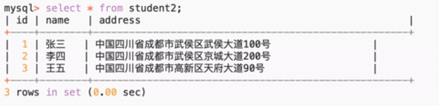
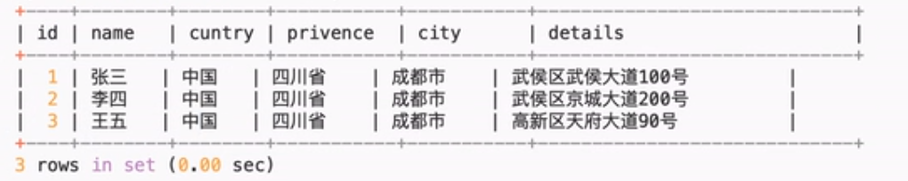

1. 第一范式 （1NF）

数据表中的所有字段都是不可分割的原子值


字段值还可以继续拆分的，就不满足第一范式


```
范式，设计的越详细，对于某些实际操作可能更好，但是不一定都是好处。
```

2. 第二范式

必须是满足第一范式的前提下，第二范式要求，除主键外的每一列都必须完全依赖与主键。
```
如果要出现不完全依赖，只可能发生在联合主键的情况下。
```

3. 第三范式

必须先满足第二范式，除开主键列的其他列之间不能有传递依赖关系。